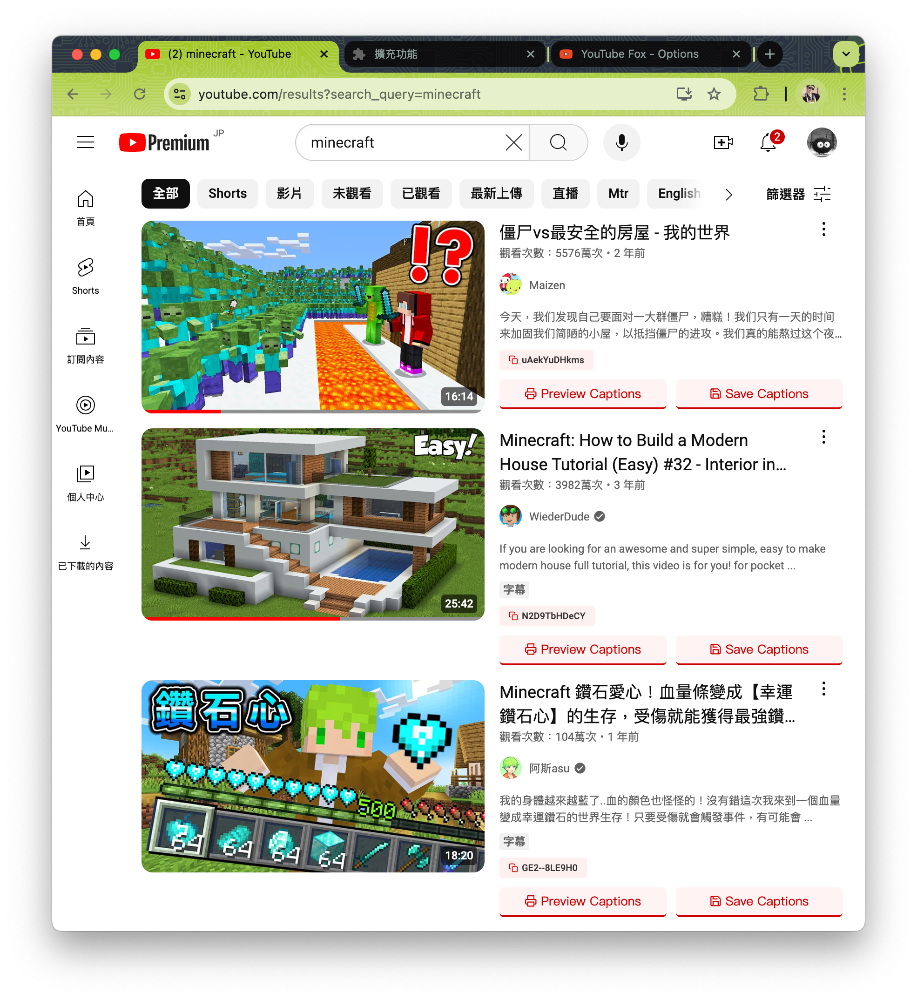
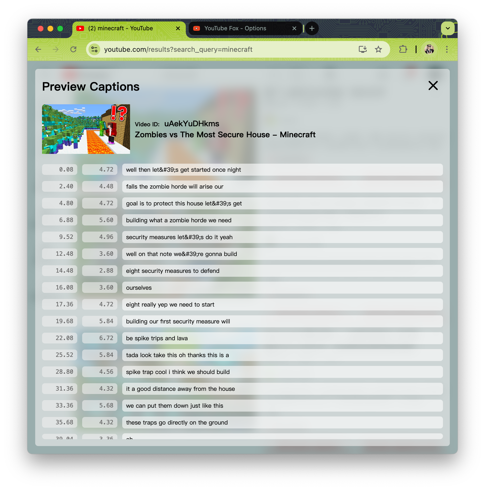
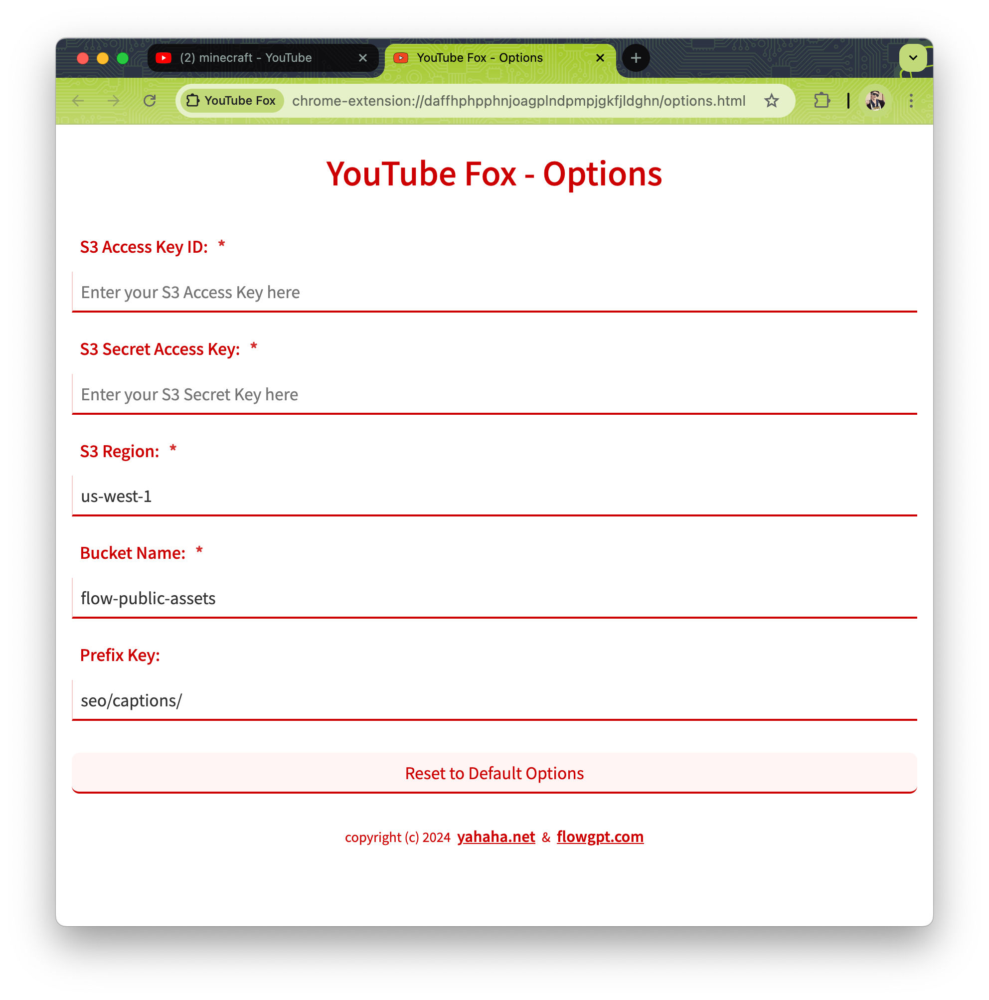

# YouTube Fox

An extension to help you to get YouTube captions and save them to S3.

## Installation

1. Open the Extension Management page by navigating to `chrome://extensions`.
2. Turn on Developer Mode.
3. Drag and drop the compressed file (e.g. `youtube-fox.zip`) to install.

## Usage

1. Open Extension Options and set the S3 Access Key, Secret Key, and Bucket Name.
1. Open YouTube website and search for any videos.
1. Click the 'Save Captions' button to save the captions to S3.

## Screenshots

